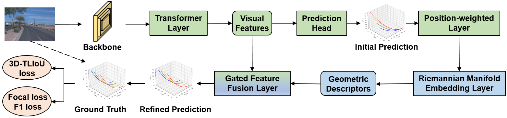
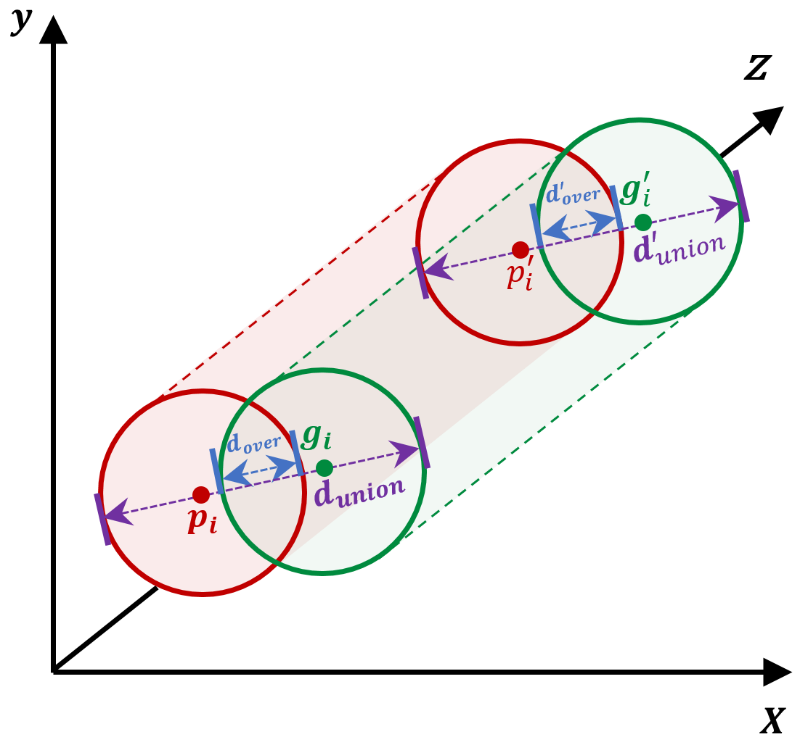
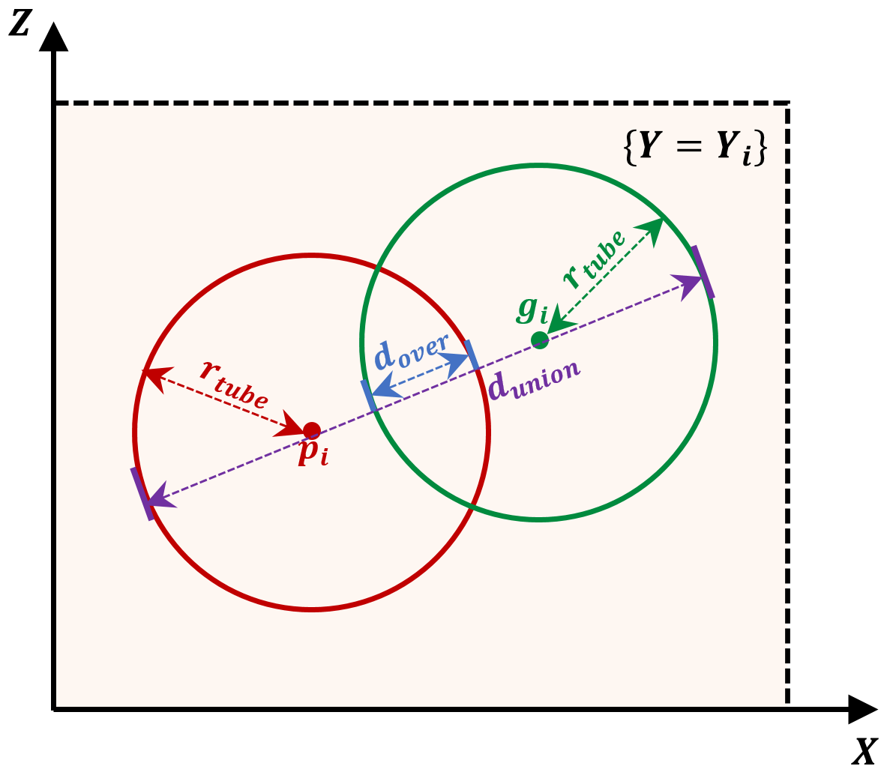

# ReManNet: A Riemannian Manifold Network for Monocular 3D Lane Detection

<p align="center">
  <b>ReManNet: A Riemannian Manifold Network for Monocular 3D Lane Detection</b>
</p>

<p align="center">
  <a href="https://arxiv.org/abs/2603.19776">
    
  </a>
  <a href="https://github.com/changehome717/ReManNet">
    
  </a>
  
  
</p>

<p align="center">
  Official repository of <b>ReManNet</b>, a Riemannian manifold network for monocular 3D lane detection.
</p>

<p align="center">
  <b>3D-TLIoU loss is now released. Full ReManNet code will be released progressively.</b>
</p>

---

## News

- **[2026]** The ReManNet paper is available on arXiv.
- **[2026]** The implementation of **3D Tunnel Lane IoU Loss (3D-TLIoU)** is released.
- The full ReManNet codebase, including Riemannian manifold modules, training configurations, evaluation scripts, and pretrained models, will be released progressively.

Paper:

[ReManNet: A Riemannian Manifold Network for Monocular 3D Lane Detection](https://arxiv.org/abs/2603.19776)

---

## Introduction

Monocular 3D lane detection aims to recover lane geometry in 3D space from a single front-view image. It is a fundamental perception task for autonomous driving, providing metric lane structure for downstream planning, lane keeping, and scene understanding.

However, monocular 3D lane detection remains challenging due to depth ambiguity and weak geometric constraints. Existing methods usually rely on depth guidance, BEV projection, or anchor-based and curve-based prediction heads. Although effective, these methods often remap high-dimensional image features while only weakly encoding the intrinsic geometry of roads and lanes.

To address this issue, we propose **ReManNet**, a Riemannian manifold network for monocular 3D lane detection. ReManNet is built upon the **Road-Manifold Assumption**, where the road surface is modeled as a smooth 2D manifold embedded in 3D space, lane markings are regarded as 1D submanifolds, and sampled lane points are treated as dense observations.

Based on this formulation, ReManNet encodes lane geometry as Riemannian Gaussian descriptors on the symmetric positive-definite manifold and fuses them with visual features through a lightweight gating module. We also introduce the **3D Tunnel Lane IoU Loss**, which provides shape-level supervision by computing slice-wise overlap between tubular neighborhoods along predicted and ground-truth lanes.

---

## Framework

<p align="center">
  
</p>

<p align="center">
  <em>Overall architecture of ReManNet.</em>
</p>

ReManNet follows a visual-geometric refinement pipeline for monocular 3D lane detection. Given a single front-view image, the backbone and transformer layer first extract visual features and generate initial 3D lane predictions. The predicted lane points are then processed by a position-weighted layer and further encoded by a Riemannian manifold embedding layer to obtain geometry-aware descriptors.

The resulting geometric descriptors are fused with visual features through a gated feature fusion layer, enabling the network to refine 3D lane predictions with both image evidence and manifold-based geometric consistency. The model is supervised by standard classification and regression objectives together with the proposed 3D-TLIoU loss.

---

## Highlights

### Road-Manifold Assumption

We introduce the Road-Manifold Assumption to provide a principled geometric foundation for monocular 3D lane detection.

The assumption models:

- road surfaces as smooth 2D manifolds in 3D space,
- lane markings as embedded 1D submanifolds,
- sampled lane points as dense observations of lane curves.

This formulation couples metric and topological structure across road surfaces, lane curves, and point sets.

### Riemannian Gaussian Geometry Encoding

ReManNet encodes local lane geometry as Riemannian Gaussian descriptors on the symmetric positive-definite manifold. This representation captures spatial correlations, local structural consistency, and geometric variation of lane points.

### Gated Visual-Geometric Fusion

A lightweight gate adaptively fuses visual features and manifold-based geometric descriptors. The visual stream provides image evidence, while the geometric stream supplies structure-aware correction for coherent 3D reasoning.

### 3D Tunnel Lane IoU Loss

We propose 3D-TLIoU, a geometry-consistent supervision objective for ordered 3D lane point sequences. It improves supervision from independent point-wise regression to curve-level alignment by considering both tunnel overlap and local directional consistency.

---

## 3D Tunnel Lane IoU Loss

We currently release the implementation of **3D Tunnel Lane IoU Loss (3D-TLIoU)**, a plug-and-play geometry-consistent supervision term for ordered 3D lane point sequences.

Different from conventional point-wise regression losses that supervise each sampled point independently, 3D-TLIoU treats a lane as a structured 3D curve and measures the shape-level consistency between predicted and ground-truth lane sequences. It constructs local tunnel neighborhoods along the lane and evaluates their slice-wise overlap, thereby encouraging both accurate point localization and coherent curve alignment.

### Spatial View

<p align="center">
  
</p>

<p align="center">
  <em>Spatial illustration of 3D-TLIoU along ordered 3D lane points.</em>
</p>

In the spatial view, the predicted lane points and ground-truth lane points form two ordered 3D point sequences. Around each sampled point, a local tunnel neighborhood is constructed. Instead of only measuring the coordinate error between isolated points, 3D-TLIoU evaluates the overlap relationship between the predicted and ground-truth tunnel regions along the lane sequence.

This design provides a more holistic supervision signal for 3D lane prediction because it jointly considers local point proximity, lane-wise continuity, and the spatial consistency of the whole curve.

### Slice View

<p align="center">
  
</p>

<p align="center">
  <em>Slice-wise tunnel-overlap surrogate in the plane {Y = Y<sub>i</sub>}.</em>
</p>

For each sampled longitudinal position, 3D-TLIoU evaluates the relationship between the predicted point and the ground-truth point in the corresponding slice plane. The red circle denotes the tunnel neighborhood around the predicted point, while the green circle denotes the tunnel neighborhood around the ground-truth point.

The overlap distance measures the shared region between two tunnel neighborhoods, while the union distance measures their overall coverage. When the two tunnel neighborhoods overlap, the formulation behaves as an IoU-style geometric alignment objective. When they are disjoint, the signed overlap term is allowed to become negative, explicitly reflecting the separation between the predicted and ground-truth tunnel regions.

This signed formulation is intentional. It avoids treating all non-overlapping cases equally and provides a stronger distance-aware penalty when predictions move farther away from the ground-truth lane. As a result, 3D-TLIoU can improve the supervision quality of ordered 3D lane points with minimal changes to existing training pipelines.

---

## Current Release

This repository currently releases the implementation of **3D-TLIoU loss**.

| Component | Status | Description |
|---|---|---|
| 3D-TLIoU Loss | Released | Plug-and-play geometric supervision for ordered 3D lane point sequences |
| Riemannian Gaussian Geometry Module | Coming soon | SPD-manifold-based geometric descriptor encoding |
| Gated Visual-Geometric Fusion | Coming soon | Adaptive fusion of visual and manifold geometric features |
| Training and Evaluation Code | Coming soon | Full pipeline for OpenLane and ApolloSim |
| Pretrained Models | Coming soon | Checkpoints for reproduced benchmark results |

The released 3D-TLIoU loss can be integrated into existing monocular 3D lane detection frameworks or general 3D point-sequence regression models. It is designed to enhance the supervision of ordered 3D point sequences by introducing curve-level geometric alignment, while requiring only minimal modifications to the original training pipeline.

The full ReManNet codebase, including the Riemannian manifold modules, visual-geometric fusion components, training configurations, evaluation scripts, and pretrained models, will be released progressively.

Please consider **starring** and **watching** this repository to receive updates when the complete implementation is available.

---

## Main Results

### OpenLane

| Method | Backbone | F1 (%) ↑ | Cate Acc (%) ↑ | Ex/N ↓ | Ex/F ↓ | Ez/N ↓ | Ez/F ↓ |
|---|---|---:|---:|---:|---:|---:|---:|
| Anchor3DLane | ResNet-50 | 57.5 | 91.6 | 0.233 | 0.246 | 0.080 | 0.106 |
| ReManNet | ResNet-18 | 63.5 | 92.8 | 0.222 | 0.265 | 0.069 | 0.089 |
| ReManNet | ResNet-50 | **65.7** | **94.7** | **0.189** | **0.205** | **0.060** | **0.072** |

### Scenario-Level Improvements on OpenLane

ReManNet achieves strong performance in challenging scenarios, including:

- uphill and downhill roads,
- curved roads,
- extreme weather,
- nighttime scenes,
- intersections,
- merge and split scenarios.

Compared with the baseline, ReManNet improves the OpenLane F1 score by **+8.2%**, and surpasses the previous best method Glane3D by **+1.8%**.

---

<!--
## Installation

### Environment

This project is implemented with PyTorch. We recommend using a conda environment.

```bash
conda create -n remannet python=3.8 -y
conda activate remannet
```

Install PyTorch according to your CUDA version. For example:

```bash
pip install torch torchvision torchaudio
```

Then install the required packages:

```bash
pip install -r requirements.txt
```

---

## Dataset Preparation

### OpenLane

Please download the OpenLane dataset from the official source and organize it as follows:

```text
data/
└── OpenLane/
    ├── images/
    ├── lane3d_300/
    ├── training/
    └── validation/
```

### ApolloSim

Please download ApolloSim and organize it as follows:

```text
data/
└── ApolloSim/
    ├── images/
    ├── labels/
    └── splits/
```

Please modify the dataset paths in the configuration files before training or evaluation.

---

## Training

To train ReManNet on OpenLane with a ResNet-50 backbone:

```bash
python tools/train.py configs/remannet/remannet_openlane_r50.py
```

To train with a ResNet-18 backbone:

```bash
python tools/train.py configs/remannet/remannet_openlane_r18.py
```

For distributed training:

```bash
bash tools/dist_train.sh configs/remannet/remannet_openlane_r50.py 4
```

---

## Evaluation

To evaluate a trained model:

```bash
python tools/test.py configs/remannet/remannet_openlane_r50.py \
    checkpoints/remannet_openlane_r50.pth
```

For distributed evaluation:

```bash
bash tools/dist_test.sh configs/remannet/remannet_openlane_r50.py \
    checkpoints/remannet_openlane_r50.pth 4
```

---
-->

<!--
## Visualization

<p align="center">
  
</p>

ReManNet improves 3D lane structure prediction by reducing geometric distortion such as concavity, bulging, twisting, and far-range localization drift.

---
-->

<!--
## Code Structure

ReManNet/
├── configs/                  # Configuration files
├── data/                     # Dataset directory
├── docs/                     # Additional documentation
├── models/                   # Model definitions
│   ├── backbones/            # Image backbones
│   ├── heads/                # Detection heads
│   ├── geometry/             # Riemannian geometry modules
│   └── losses/               # Loss functions, including 3D-TLIoU
├── tools/                    # Training and evaluation scripts
├── assets/                   # Figures and visualization examples
├── checkpoints/              # Pretrained models
├── requirements.txt
├── LICENSE
└── README.md

---
-->

<!--
## TODO

- [ ] Release full training code.
- [ ] Release evaluation code.
- [ ] Release pretrained models.
- [ ] Release OpenLane configuration files.
- [ ] Release ApolloSim configuration files.
- [ ] Add visualization scripts.
- [ ] Add detailed documentation for the Riemannian geometry module.

---
-->

## Paper

The paper is available at:

[ReManNet: A Riemannian Manifold Network for Monocular 3D Lane Detection](https://arxiv.org/abs/2603.19776)

---

## Citation

If you find this project useful for your research, please consider starring this repository and citing our work:

```bibtex
@article{hong2026remannet,
  title   = {ReManNet: A Riemannian Manifold Network for Monocular 3D Lane Detection},
  author  = {Hong, Chengzhi and Li, Bijun},
  journal = {arXiv preprint arXiv:2603.19776},
  year    = {2026}
}
```

---

## Acknowledgement

This project is developed based on the monocular 3D lane detection research community.

We sincerely thank the authors of OpenLane, ApolloSim, Anchor3DLane, PersFormer, LATR, GLane3D, and other related works for their valuable contributions to 3D lane detection research.

If this project uses or modifies code from existing open-source projects, please follow their original licenses and citation requirements.

---

## License

This repository is released for academic research purposes.

Please refer to the `LICENSE` file for detailed terms.

---

## Contact

For questions, discussions, or collaboration, please contact:

```text
Chengzhi Hong
State Key Laboratory of Information Engineering in Surveying, Mapping and Remote Sensing
Wuhan University
Email: ht005305@whu.edu.cn
```
